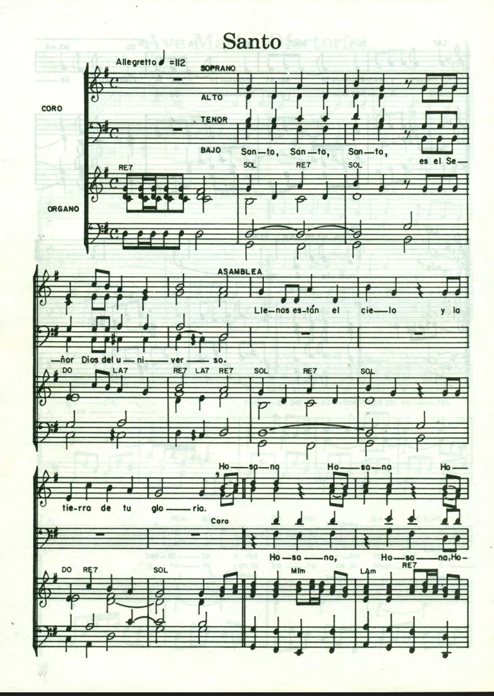
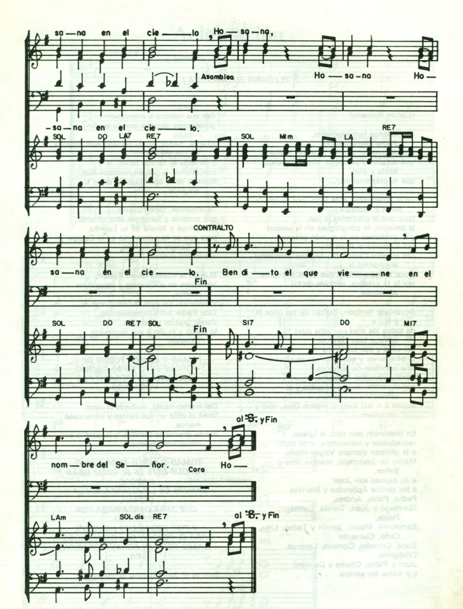

# Santo


```bash
E      B7     E         A                F#7 E B7
SANTO, SANTO, SANTO ES EL SEÑOR DIOS DEL UNIVERSO.
E      B7         E            A           B7    E
LLENOS ESTÁN EN EL CIELO Y EN LA TIERRA DE TU GLORIA

E     C#m F#m B7   E      F#7    E B7
HOSSANA, HOSSANA, HOSSANA EN EL CIELO,
E     C#m F#m B7   E      A  B7   E
HOSSANA, HOSSANA, HOSSANA EN EL CIELO,

G#7              C#mC#7    F#m  F#7     Bsus4 B7
BENDITO EL QUE VIENE EN EL NOMBRE DEL SEÑOR

E     C#m F#m B7   E      F#7    E B7
HOSSANA, HOSSANA, HOSSANA EN EL CIELO,
E     C#m F#m B7   E      A  B7   E
HOSSANA, HOSSANA, HOSSANA EN EL CIELO,
```




